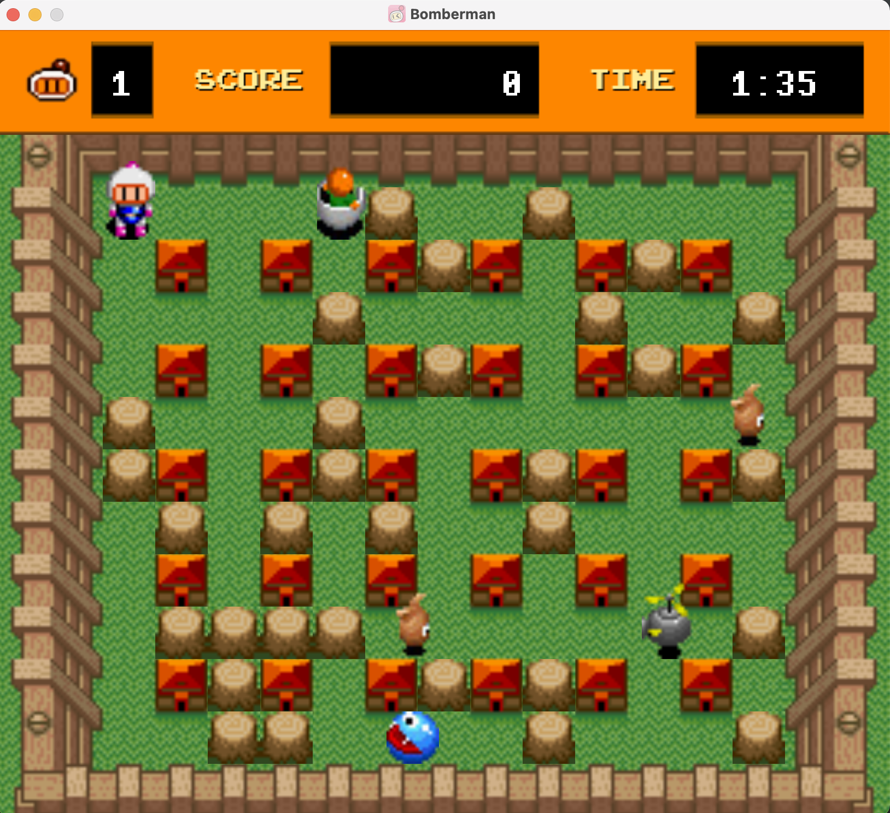
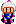
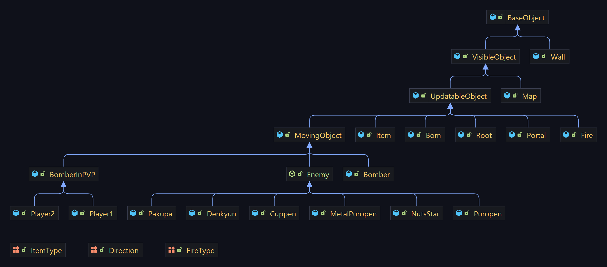
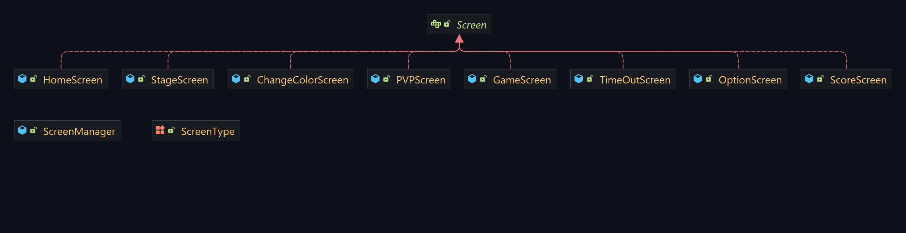
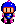
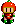

# Super Bomberman


*Bài tập lớn do nhóm OOP_N2_BTL_N10 thực hiện*
- 21020289 Phạm Bá Danh
- 21020413 Trương Thị Huyền Trâm
- 21020287 Phạm Kim Chi

Phiên bản Java mô phỏng lại trò chơi Bomberman kinh điển:

Nhân vật Bomberman phải tìm cách vượt qua mê cung và đối diện với kẻ thù. Lối thoát khỏi mê cung nằm bên dưới những gốc cây. Bomberman sẽ đặt các quả bom để đốt cháy gốc cây và tấn công địch. Bomberman cần tiêu diệt hết kẻ địch và tìm đến cửa thoát để chinh phục các mê cung khó hơn và giành chiến thắng khi thoát khỏi tất cả các mê cung.

## Mục lục:
- [1. Cài đặt trò chơi](https://github.com/pbdanh/Bomberman#1c%C3%A0i-%C4%91%E1%BA%B7t-tr%C3%B2-ch%C6%A1i)
- [2. Cách chơi](https://github.com/pbdanh/Bomberman#2c%C3%A1ch-ch%C6%A1i)
- [3. Các đối tượng trong game](https://github.com/pbdanh/Bomberman#3c%C3%A1c-%C4%91%E1%BB%91i-t%C6%B0%E1%BB%A3ng-trong-game)
- [4. Cây kế thừa](https://github.com/pbdanh/Bomberman#4c%C3%A2y-k%E1%BA%BF-th%E1%BB%ABa)
- [5. Menu](https://github.com/pbdanh/Bomberman#5menu)
- [6. Nguồn](https://github.com/pbdanh/Bomberman#6ngu%E1%BB%93n)

## 1. Cài đặt trò chơi

Sử dụng maven và plugins javafx để chạy trò chơi

```bash
mvn clean javafx:run
```

## 2. Cách chơi
- Sử dụng các phím mũi tên để điều khiển Bomber, nhấn SPACE để đặt bom.
- Sử dụng ENTER và các phím mũi tên để tuỳ chọn menu.
- Nhấn ESC để thoát khỏi trò chơi và chương trình.
### [Demo]()
## 3. Các đối tượng trong game

-  *Bomber* là nhân vật chính của trò chơi. Bomber có thể di chuyển theo 4 hướng trái/phải/lên/xuống theo sự điều khiển của người chơi.
-  *Enemy* là các đối tượng mà Bomber phải tiêu diệt hết để có thể qua Level. Enemy có thể di chuyển ngẫu nhiên hoặc tự đuổi theo Bomber tùy theo loại Enemy. Các loại Enemy sẽ được mô tả cụ thể ở phần dưới.
-  *Bomb* là đối tượng mà Bomber sẽ đặt và kích hoạt tại các ô Grass. Khi đã được kích hoạt, Bomber và Enemy không thể di chuyển vào vị trí Bomb. Tuy nhiên ngay khi Bomber vừa đặt và kích hoạt Bomb tại ví trí của mình, Bomber có một lần được đi từ vị trí đặt Bomb ra vị trí bên cạnh. Sau khi kích hoạt 2s, Bomb sẽ tự nổ, các đối tượng *Fire*  được tạo ra.
-  *Root* là đối tượng được đặt lên các ô Grass, không cho phép đặt Bomb lên nhưng có thể bị phá hủy bởi Bomb được đặt gần đó. Bomber và Enemy thông thường không thể di chuyển vào vị trí Root khi nó chưa bị phá hủy.
-  *Wall* là đối tượng cố định, không thể phá hủy bằng Bomb cũng như không thể đặt Bomb lên được, Bomber và Enemy không thể di chuyển vào đối tượng này
-   *Portal* là đối tượng được giấu phía sau một đối tượng Brick. Khi Brick đó bị phá hủy, Portal sẽ hiện ra và nếu tất cả Enemy đã bị tiêu diệt thì người chơi có thể qua Level khác bằng cách di chuyển vào vị trí của Portal.
-  *Grass* là đối tượng mà Bomber và Enemy có thể di chuyển xuyên qua, và cho phép đặt Bomb lên vị trí của nó

Các *Item* cũng được giấu phía sau Root và chỉ hiện ra khi Root bị phá hủy. Bomber có thể sử dụng Item bằng cách di chuyển vào vị trí của Item. Thông tin về chức năng của các Item được liệt kê như dưới đây:
-   *SpeedItem* Khi sử dụng Item này, Bomber sẽ được tăng vận tốc di chuyển thêm một giá trị thích hợp
-  *FlameItem* Item này giúp tăng phạm vi ảnh hưởng của Bomb khi nổ (độ dài các Flame lớn hơn)
-  *BombItem* Thông thường, nếu không có đối tượng Bomb nào đang trong trạng thái kích hoạt, Bomber sẽ được đặt và kích hoạt duy nhất một đối tượng Bomb. Item này giúp tăng số lượng Bomb có thể đặt thêm một.
-  *LivesItem* Khi sử dụng Item này, Bomber sẽ được tăng thêm 1 mạng sống.

Các loại enemy đã cài đặt:
-  *Puropen*: enemy đơn giản nhất, di chuyển ngẫu nhiên với tốc độ cố định.
-  *Metal Puropen*: enemy có hai mạng, di chuyển ngẫu nhiên với tốc độ cố định.
-  *Denkyun*: enemy có khả năng thay đổi tốc độ đột ngột.
-  *Pakupa*: enemy có khả năng ăn  trước khi nổ.
-  *Nuts Star*: enemy biết đuổi theo Bomber
-  *Cuppen*: enemy có khả năng đi đè lên .
### [Demo Enemy]()
## 4. Cây kế thừa




## 5. Menu
- Home Menu: cổng vào khi bắt đầu chạy chương trình
  + Normal Game: chế độ một người chơi
  + PVP Game: chế độ hai người chơi
  + Option Menu: tuỳ chọn mute/unmute nhạc nền và hiệu ứng âm thanh
- Color Menu: tuỳ chọn màu cho Bomber    
- Game Menu: hiển thị bản đồ màn chơi, số mạng của Bomber, điểm số và thời gian
## 6. Nguồn
[Asset](https://www.spriters-resource.com/snes/sbomber/)

[Sound](https://www.sounds-resource.com/snes/superbomberman/sound/35684/)

[Music](https://youtu.be/2wPZvDrQ83A)