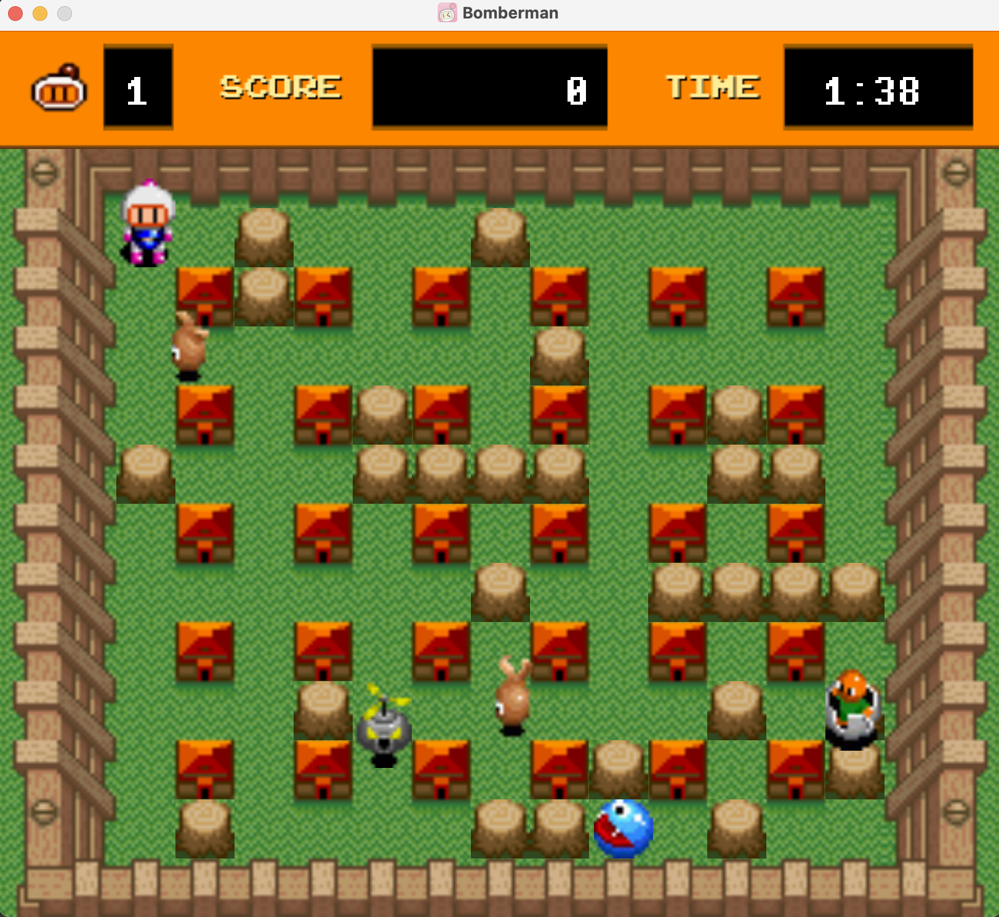

# Super Bomberman

//mô tả chung về trò chơi + hình ảnh preview + table of contents



## Cài đặt trò chơi

Sử dụng maven và plugins javafx để chạy trò chơi

```bash
mvn clean javafx:run
```

## Cách chơi
- Sử dụng các phím mũi tên để điều khiển Bomberman, nhấn SPACE để đặt bom.
- Sử dụng ENTER và các phím mũi tên để tuỳ chọn menu.
- Nhấn ESC để thoát khỏi trò chơi và chương trình.
## Các đối tượng trong game

//mô tả chung về các đối tượng trong game có kèm hình ảnh

## Cây kế thừa

## Menu
- Home Menu: cổng vào khi bắt đầu chạy chương trình
    + Normal Game: chế độ một người chơi
    + PVP Game: chế độ hai người chơi (updating)
    + Option Menu: tuỳ chọn mute/unmute nhạc nền và hiệu ứng âm thanh
- Color Menu: tuỳ chọn màu cho Bomberman
## Nguồn
[Asset](https://www.spriters-resource.com/snes/sbomber/)

[Sound](https://www.sounds-resource.com/snes/superbomberman/sound/35684/)

[Music](https://youtu.be/2wPZvDrQ83A)